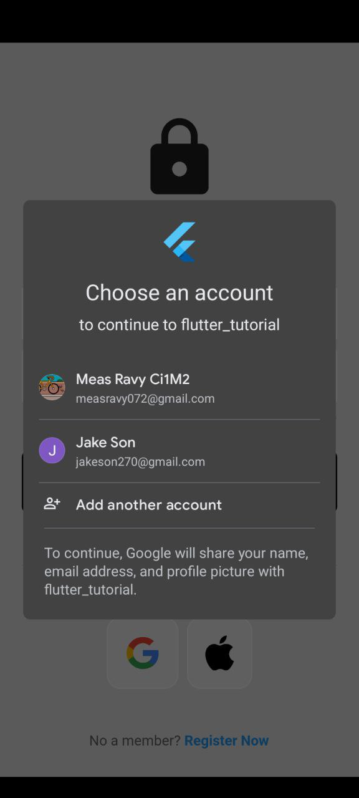
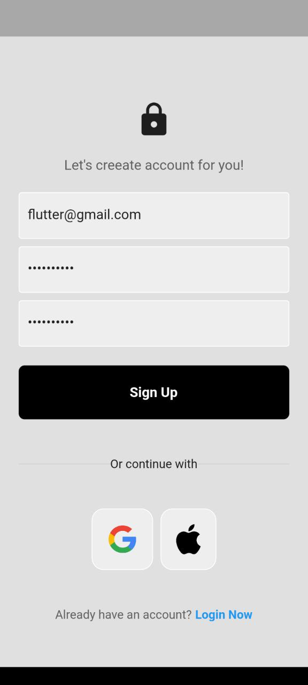
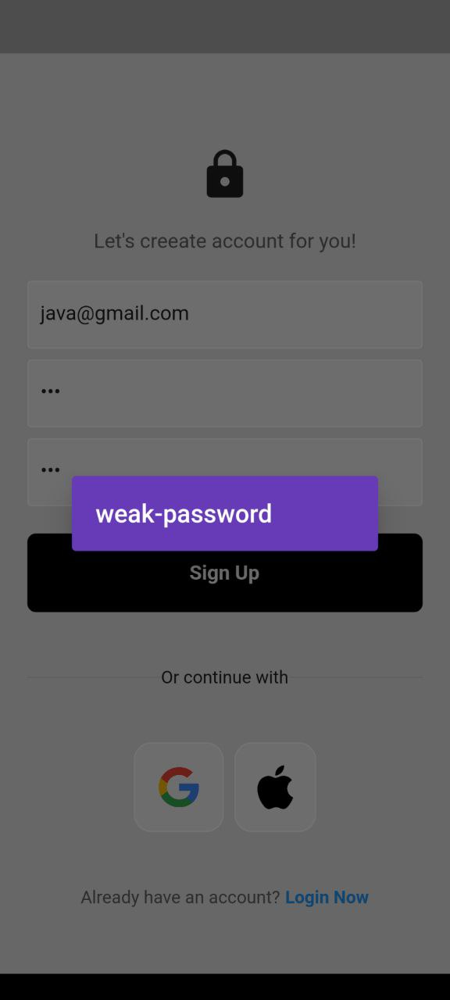
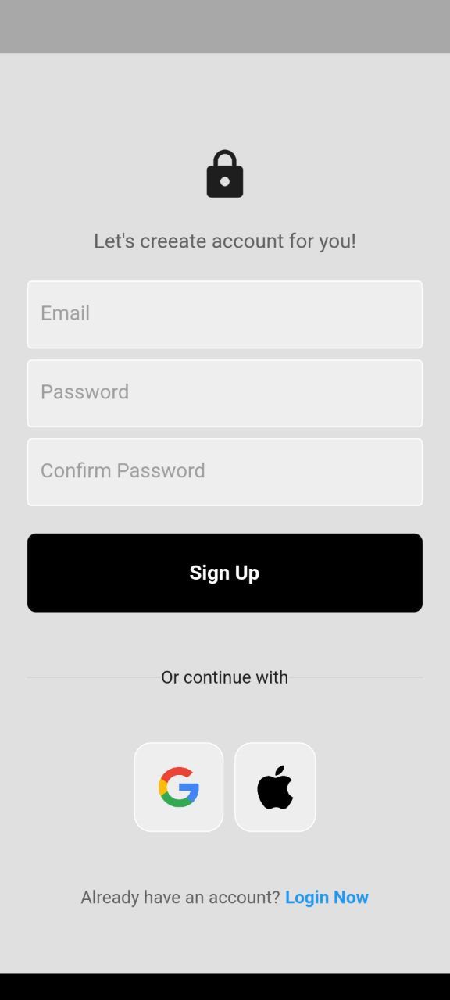

# Flutter Firebase Authentication

A Flutter app with Firebase Authentication that allows users to sign in using Google Sign-In and Email/Password authentication. Users can log in, log out, and manage their sessions.

## 🚀 Features

 **Google Sign-In Authentication**  

 **Firebase Email/Password Authentication**  

 **User Registration (Sign-Up)**   

 **Secure Firebase Authentication**  

 **Responsive UI login**  

 **Responsive UI Register**  

 **Responsive UI home page whit button logout**  

