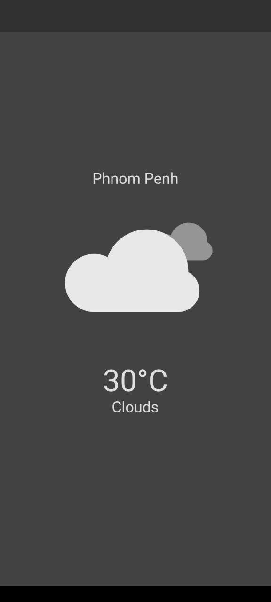
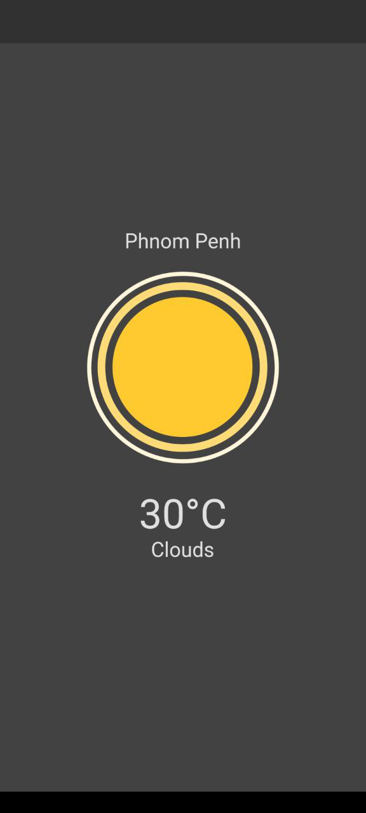
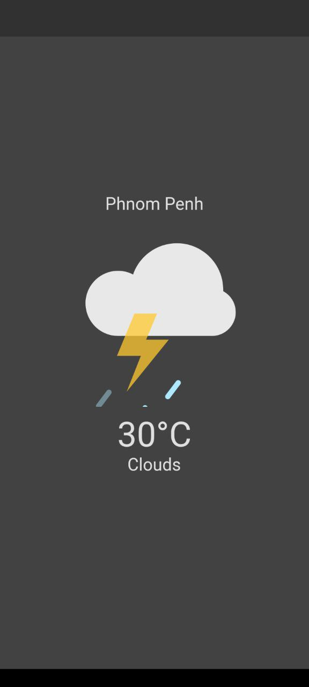

# 🌤️ Flutter Weather App

 A simple Flutter weather app that fetches real-time weather data using the **OpenWeatherMap API** and displays animations based on weather conditions.

 ## 📌 Features
✔️ Get real-time weather data for any city  
✔️ Fetch user's current location weather  
✔️ Display weather animations using Lottie  
✔️ Beautiful UI with Flutter  

## Screenshots
 
 

